# Installation

1. Clone the repo onto your device: `git clone https://github.com/Blockchain-2235/PawnGoats-DApp/`
2. Navigate to the hardhat directory
3. Install hardhat: `npm install --save-dev hardhat`
   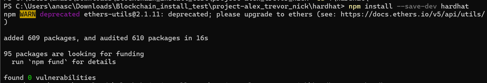
4. Navigate to the backend directory
5. Install the following:
   - `npm install dotenv@16.4.5`
   - `npm install ethers@5.7.2` (IT MUST BE VERSION 5.7.2)
     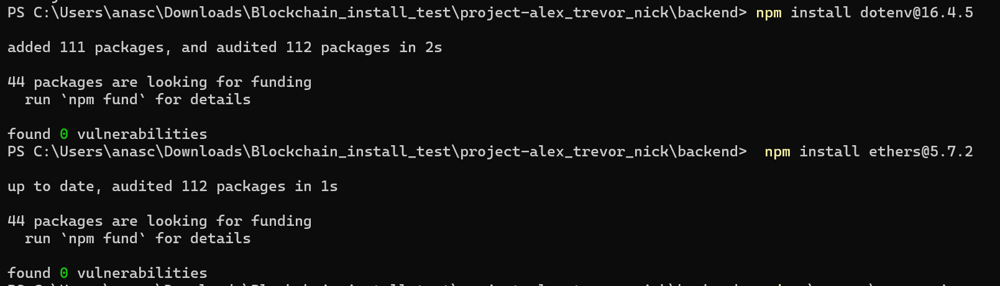
6. Navigate to the goat-ui directory
7. Install the necessary node packages: `npm install`
   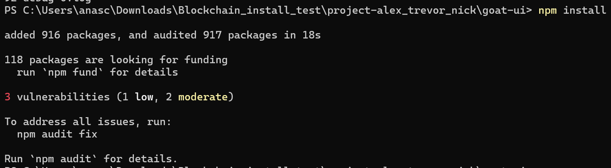

<br/>
<br/>

# Hardhat Testing

For the fastest testing experience of the contract functionality, it is recommended to test within hardhat directly. The BusinessContract.ts file simulates the API we created and tests both the business contract and the dynamically created transaction contracts. The test file only ever directly calls functions within the Business contract. The Business contract then makes calls to the apppropriate Transaction contract for certain information and functions. The BusinessContract.ts file in the hardhat\test\ directory is thoroughly commented to explain all tests and tests many edge cases not implemented in the front end or API due to time constraints.

1. navigate to the hardhat directory and run `npx hardhat test`

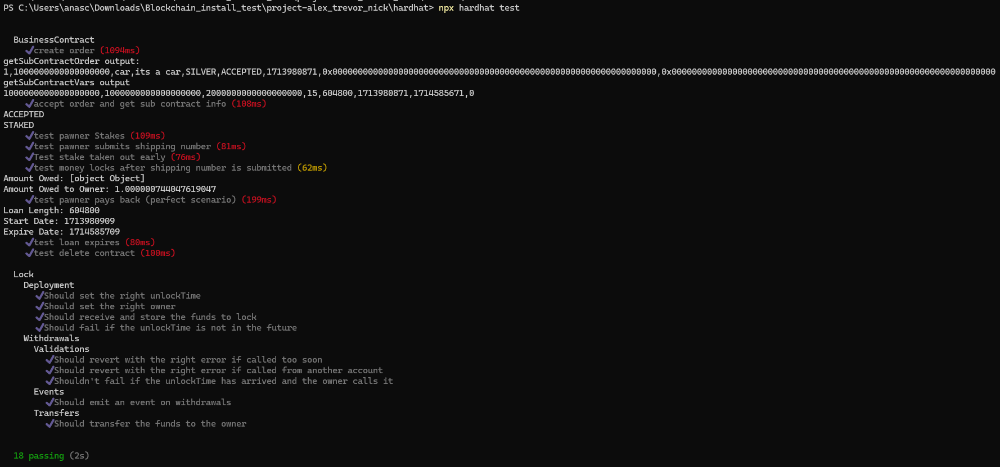

# Ganache Setup

- Load Ganache “Quickstart Ethereum”
- Click Settings (Gear Icon) -> Chain
  - Change “Gas Limit” to 10000000000000
  - Change “Gas Price” to 1
    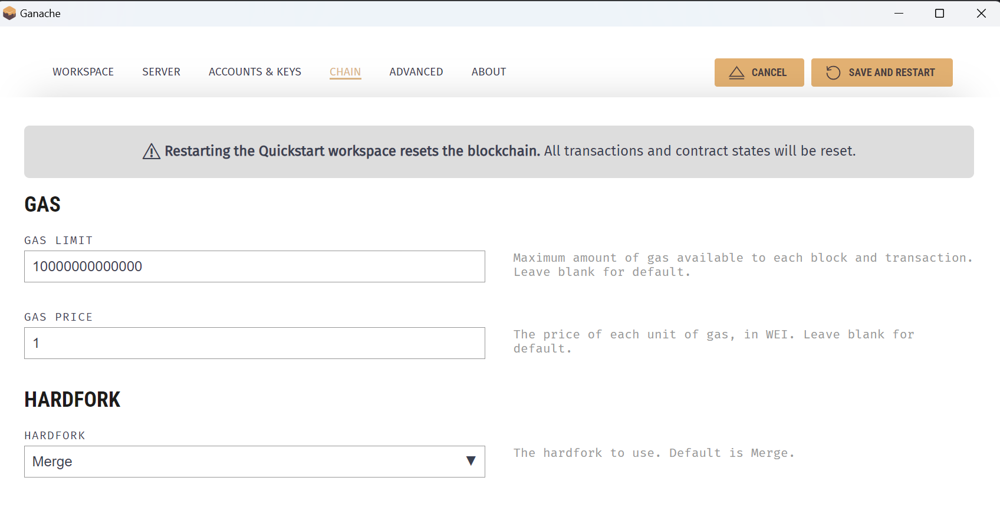
- Click “Save and Restart”
- Save two private keys
  - One will represent the business owner
  - One will represent a customer

<br/>
<br/>

# Dotenv Setup

- Navigate to the backend directory
- Create a “.env” file under the backend root directory
- Create a GANACHE_URL global variable as your ganache URL
  - Example: GANACHE_URL = “http://localhost:7545”
- Create OWNER_PRIVATE_KEY global variable as account 1’s private key
  - Example: OWNER_PRIVATE_KEY = "0x6a5f65117492e5b06259575852fdedcdcc5d59ceaf078f7905e1d07895c5317b"
- Create PAWNER_PRIVATE_KEY global variable as account 2’s private key
  - Example: PAWNER_PRIVATE_KEY = "0xbf13430d97e1e27e6c8914402b6c4cdef54866461cea6e2b5640f37fa36f5071"

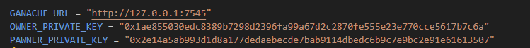

<br/>
<br/>

# Deploying the DAPP

### **OPTIONAL :**

Should any changes be made to the BusinessContract.sol file that alter the contracts behavior, the following MUST be completed:

1. Compile smart contract in \hardhat\ using `npx hardhat compile`
2. Open file \hardhat\artifacts\contracts\BusinessContract.sol\BusinessContract.json
3. Copy ABI and bytecode into \backend\deploy\deployContract.js
4. Copy .\BusinessContract.json file into \backend\contractJson\BusinessContract.json

---

### **REQUIRED :**

As long as no changes were made to the smart contract, the correct ABI/bytecode is already present inside \backend\deploy\deployContract.js. Ganache must be open and using the workspace previously configured. Unless this workspace is saved, Ganache will reset keys and settings each time you quickstart.

Steps to deploy are as follows:

1. navigate to the backend directory and run `node .\deploy\deployContract.js`

   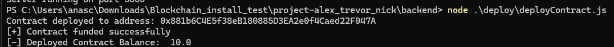

2. Navigate back to your .env file and add the global variable for CONTRACT_ADDRESS using the output address displayed after running step 1.

   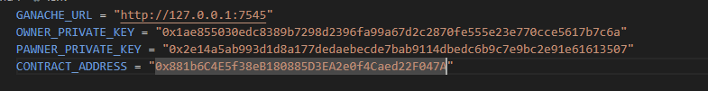

3. Run backend server using the command `node .\server\server.js`

   - The server will automatically host on localhost:5000
   - This server connects to the smart contract provided as CONTRACT_ADDRESS

   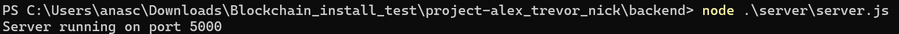

4. Open a new terminal window

5. navigate to the goat-ui directory and run `ng serve -o`

   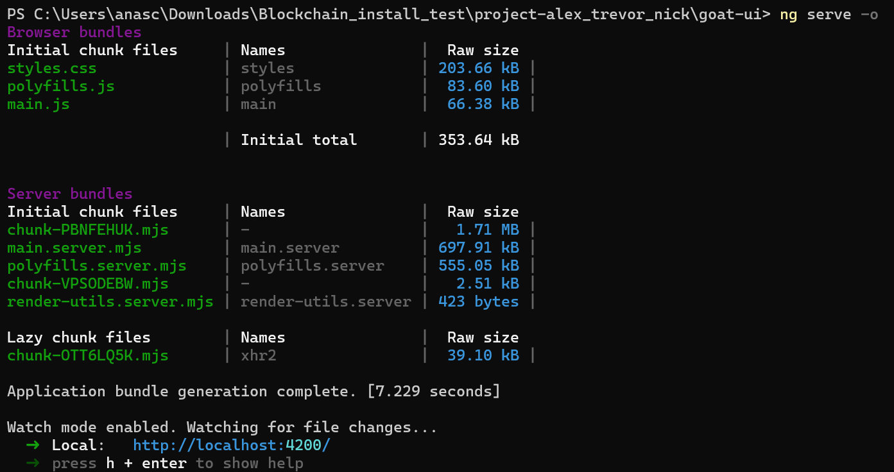

6. After a short period of time, your web browser should launch automatically and display the webpage

# Example Workflow

This workflow is the only fully functioning workflow implemented full stack. While many edge cases are covered in our contract logic, due to time constraints we were only able to implement a perfect scenario for our Proof of Concept.

1. complete the steps above
2. in the UI create a new order by filling in the form fields and clicking the Submit button

   - note for easy testing, the price is in ethereum by default and the interest rates are very high.

   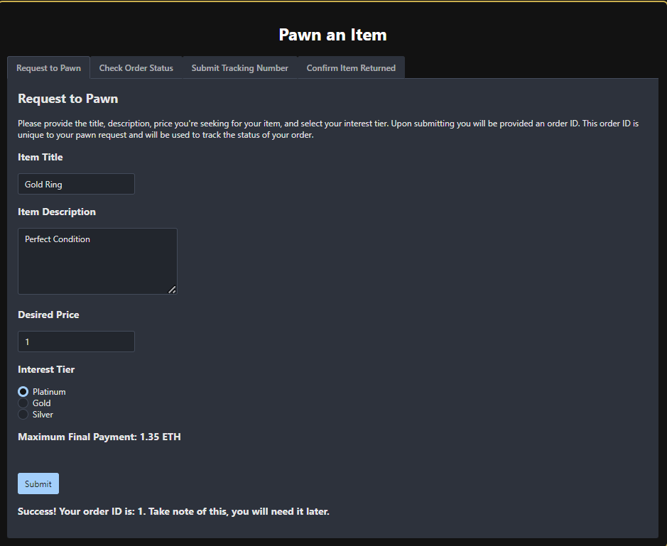

3. Click the Admin Button in the top right
4. Click the Y button to accept the order

   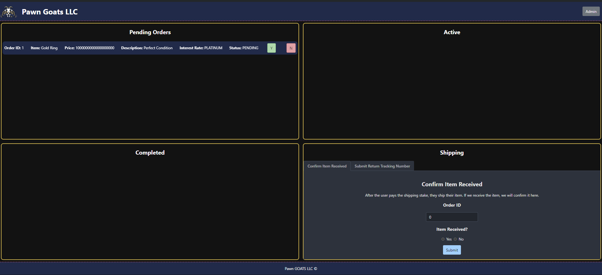

5. Click on `Pawn Goats LLC` in the top left to go back to the pawner view

6. click on the "Check Order Status" tab

7. type in the orderID (in this case 1) and click submit

   - copy the address displayed underneath

   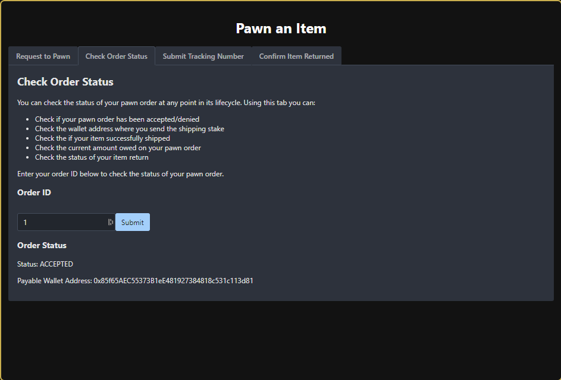

8. Now navigate to the server directory

   - Edit the userShippingStake.js file
   - change the `DESTINATION_ADDRESS`global variable to be the address displayed when checking the status in step 7

   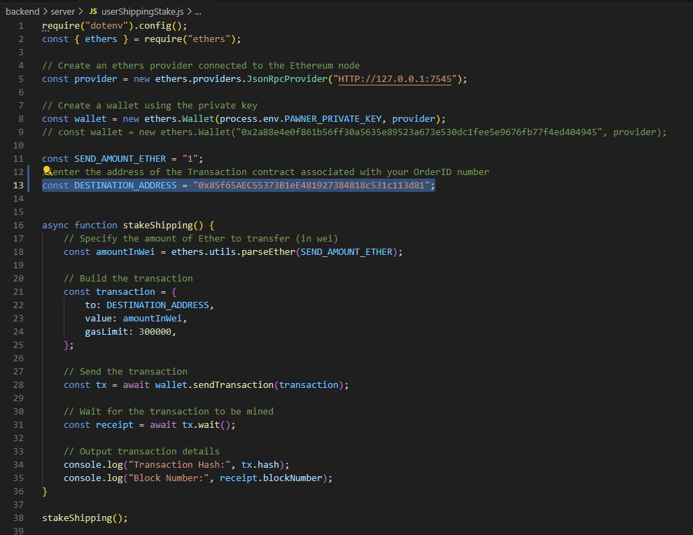

9. in a separate terminal window, navigate to the backend directory and run `node .\server\userShippingStake.js`

   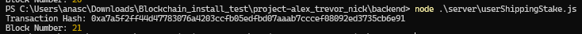

10. Now navigate back to the "Check Order Status" tab and reclick submit, the status should now be staked

    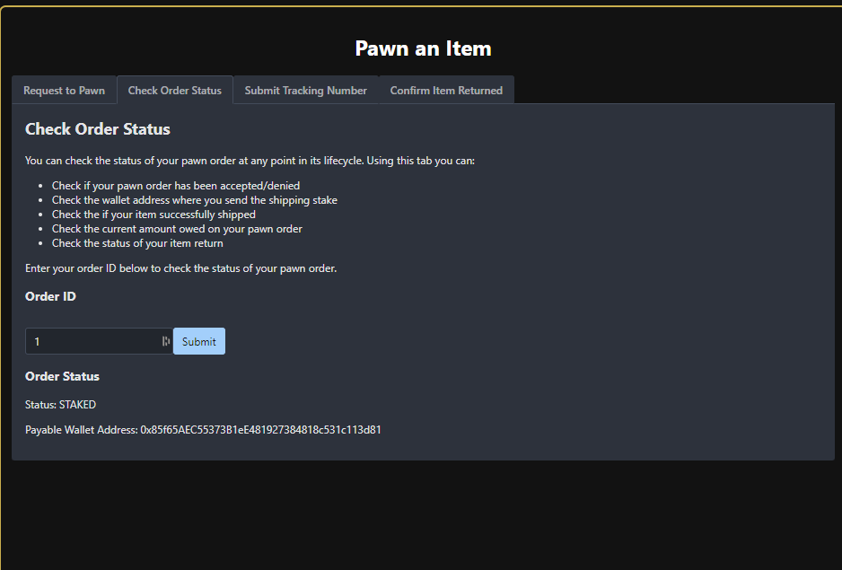

11. Now navigate to the "Submit Tracking Number" tab and enter the OrderID and an arbitrary "Shipping tracking number" and click Submit

    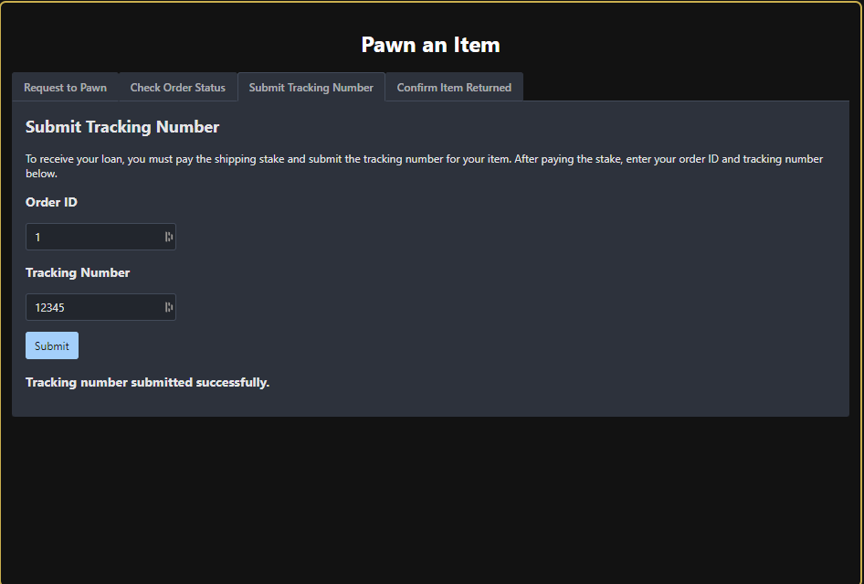

12. Navigate back to the admin page. Under Shipping type in the orderID, click the "yes" radio button and Submit

    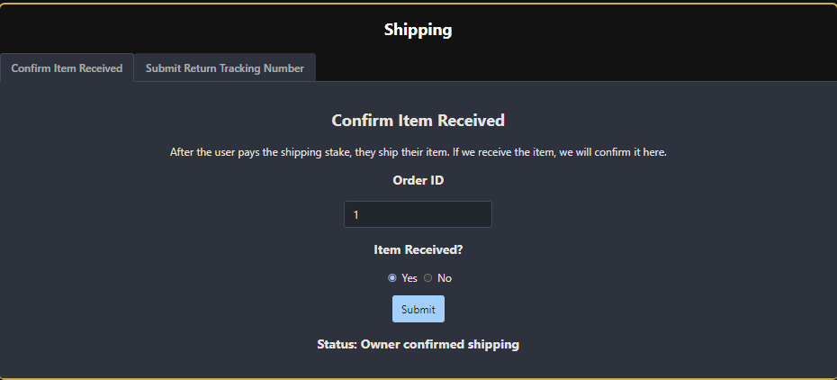

13. Navigate back to the Pawner page by clicking on `Pawn Goats LLC` in the top left

14. Once again navigate back to the "Check Order Status" tab and reclick submit, the status should now be in progress and the amount owed should be displayed

    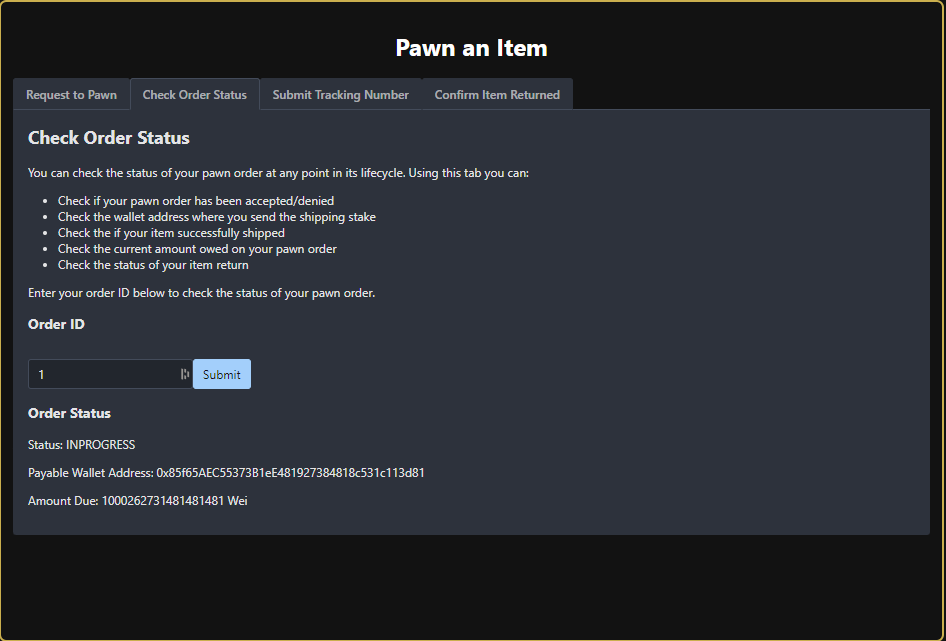

15. Navigate back to the \backend\server directory and edit the userRepayLoan.js file

    - change the `DESTINATION_ADDRESS`global variable to be the address displayed when checking the status in step 14
    - change `AMOUNTINWEI` to equal the amount owed
    - note you only have ten minutes to pay back or else you will have to check the order status again to obtain the new "amount owed"

    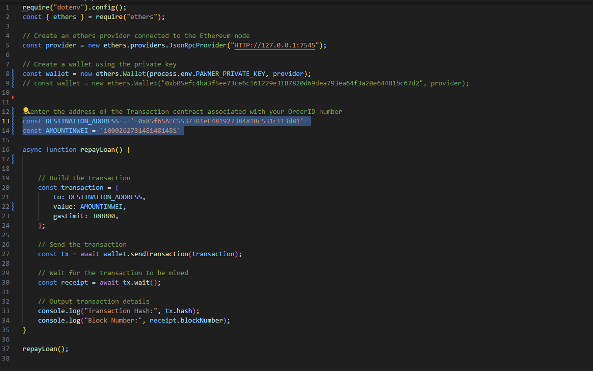

16. in a separate terminal window, navigate to the backend directory and run `node .\server\userRepayLoan.js`

    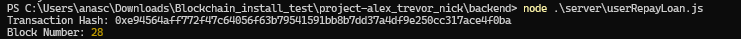

17. Navigate back to the admin page. As you can see, the order status automatically updates every time the admin page is reloaded. The order will also move to a different part of the window based on what stage it is in

18. Under the Shipping section, click on the "Submit Return Tracking Number" tab enter the OrderID and an arbitrary "Shipping tracking number" and click Submit

    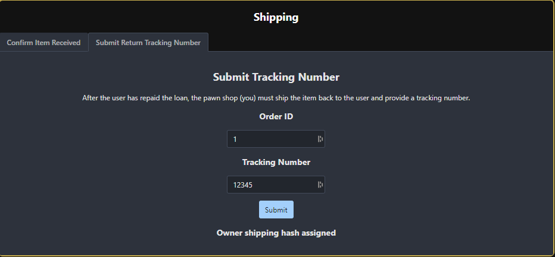

19. Navigate back to the pawner page and click on the "Confirm Item Returned" tab

    - enter the OrderID and click on the "Item Returned" radio button and click submit

    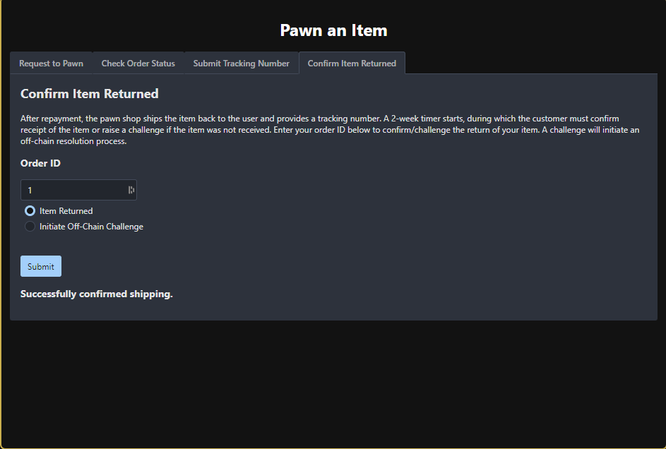

You have now completed the full workflow and the status will be set to `COMPLETED`! Feel free to see how this is displayed on the Admin page as well. In Ganache the values are rounded. We have created a number of Postman API calls however, that can be used to see true values of the contracts.

- If using this http request `localhost:5000/getBusinessContractBalance` you will see the contract has infact gained the amount of interest.

  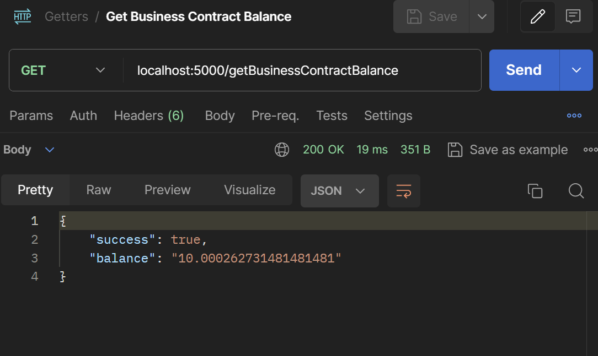

- If using this http request `localhost:5000/getSubContractBalance?orderID=1` you will see the Transaction contract balance is zero.

  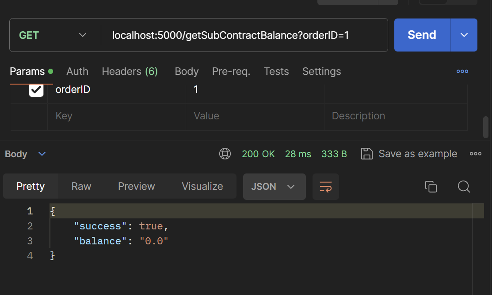

This means the pawner and Pawn shop received their stakes back and the pawn shop also received their interest. We have controls in place in the contracts so that even if the pawner over pays, they will get any extra funds back.

# Common Errors

```
        var error = new Error(message);
                    ^

Error: network does not support ENS (operation="getResolver", network="unknown", code=UNSUPPORTED_OPERATION, version=providers/5.7.2)
    at Logger.makeError (C:\Users\anasc\Downloads\Blockchain_install_test\project-alex_trevor_nick\backend\node_modules\@ethersproject\logger\lib\index.js:238:21)
    at Logger.throwError (C:\Users\anasc\Downloads\Blockchain_install_test\project-alex_trevor_nick\backend\node_modules\@ethersproject\logger\lib\index.js:247:20)
    at JsonRpcProvider.<anonymous> (C:\Users\anasc\Downloads\Blockchain_install_test\project-alex_trevor_nick\backend\node_modules\@ethersproject\providers\lib\base-provider.js:2315:36)
    at step (C:\Users\anasc\Downloads\Blockchain_install_test\project-alex_trevor_nick\backend\node_modules\@ethersproject\providers\lib\base-provider.js:48:23)
    at Object.next (C:\Users\anasc\Downloads\Blockchain_install_test\project-alex_trevor_nick\backend\node_modules\@ethersproject\providers\lib\base-provider.js:29:53)
    at fulfilled (C:\Users\anasc\Downloads\Blockchain_install_test\project-alex_trevor_nick\backend\node_modules\@ethersproject\providers\lib\base-provider.js:20:58)
    at process.processTicksAndRejections (node:internal/process/task_queues:95:5) {
  reason: 'network does not support ENS',
  code: 'UNSUPPORTED_OPERATION',
  operation: 'getResolver',
  network: 'unknown'
}
```

1. This error can occur for many reasons, the most common reason is that while editing the userShippingStake.js and userRepayLoan.js files, there is an extra space in the address string. Always ensure there are no extra spaces in the address or payment strings. This goes for the .env file as well.

2. Sometimes ganache does not properly accept network traffic, saving the workspace and restarting ganache can fix this issue

3. If you deploy a contract successfully but start to get the listed error above when making the first order, restart ganache, deploy a new business contract (step 3 under Deploying DAPP -> Required).


